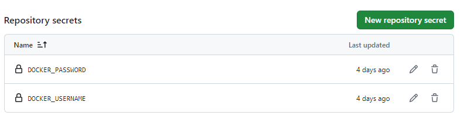

# 3D-Portfolio-Project

<link rel="stylesheet" href="https://cdnjs.cloudflare.com/ajax/libs/font-awesome/6.0.0-beta3/css/all.min.css" integrity="sha512-Hj9/J/mH0G/5ag3pHKFDBDz+9SPr9NeP9AK0lSxHXHnoSe06Y8tK4so5eeE3I/R7f8KRiJ5/bGGOh7URnHsZIw==" crossorigin="anonymous" referrerpolicy="no-referrer" />


<table>
  <tr>
    <td></td>
    <td></td>
    <td></td>
  </tr>
  <tr>
    <td>
      <a href="https://www.linkedin.com/in/ahmetaksoy">
        <i class="fab fa-linkedin"></i> Ahmet Aksoy
      </a>
    </td>
    <td>
      <a href="https://www.linkedin.com/in/mehmet">
        <i class="fab fa-linkedin"></i> Mehmet
      </a>
    </td>
    <td>
      <a href="https://www.linkedin.com/in/akifgungor">
        <i class="fab fa-linkedin"></i> Akif Güngör
      </a>
    </td>
  </tr>
  <tr>
    <td colspan="3"></td>
  </tr>
</table>

<table>
  <tr>
    <td></td>
    <td></td>
    <td></td>
  </tr>
  <tr>
    <td><a href="https://www.linkedin.com/in/ahmetaksoy" title="LinkedIn Profili">Ahmet Aksoy</a></td>
    <td><a href="https://www.linkedin.com/in/mehmet" title="LinkedIn Profili">Mehmet</a></td>
    <td><a href="https://www.linkedin.com/in/akifgungor" title="LinkedIn Profili">Akif Güngör</a></td>
  </tr>
  <tr>
    <td colspan="3"></td>
  </tr>
</table>

<table>
  <tr>
    <td></td>
    <td></td>
    <td></td>
  </tr>
  <tr>
    <td><a href="https://www.linkedin.com/in/ahmetaksoy">Ahmet Aksoy</a></td>
    <td><a href="https://www.linkedin.com/in/mehmet">Mehmet</a></td>
    <td><a href="https://www.linkedin.com/in/akifgungor">Akif Güngör</a></td>
  </tr>
  <tr>
    <td colspan="3"></td>
  </tr>
</table>


# Tech Used

<table>
  <tr>
    <td><strong>Infrastructure:</strong></td>
    <td>AWS (Amazon Web Services), Terraform</td>
  </tr>
  <tr>
    <td><strong>Containerization & Orchestration:</strong></td>
    <td>Docker</td>
  </tr>
  <tr>
    <td><strong>CI/CD Tools:</strong></td>
    <td>GitHub Actions</td>
  </tr>
  <tr>
    <td><strong>Frontend:</strong></td>
    <td>HTML, CSS, JavaScript</td>
  </tr>
  <tr>
    <td><strong>Backend:</strong></td>
    <td>Python, Flask</td>
  </tr>
  <tr>
    <td><strong>Version Control:</strong></td>
    <td>GitHub</td>
  </tr>
  <tr>
    <td><strong>Cloud Services:</strong></td>
    <td>AWS EC2, AWS VPC</td>
  </tr>
</table>


## Creating .github\workflows\build-and-push.yml

In order to push images to the Docker Hub repo, we create secrets in the Githup account and use them in the file.


We create a build-and-push.yaml file to use Github Action. And we specify the secrets inside.  

**❗ Sample Code line**

```sh

    - name: Docker Login
      run: docker login --username ${{ secrets.DOCKER_USERNAME }} -p ${{ secrets.DOCKER_PWD }}

```

We go to Repo > Setting > Secrets and variables > Actions and create "New repository secrets" here.




```sh


```


```sh


```


# Video-1 30 dk

Source kodlar kullanilan iconlar 

https://boxicons.com/

adresinden alinmistir


